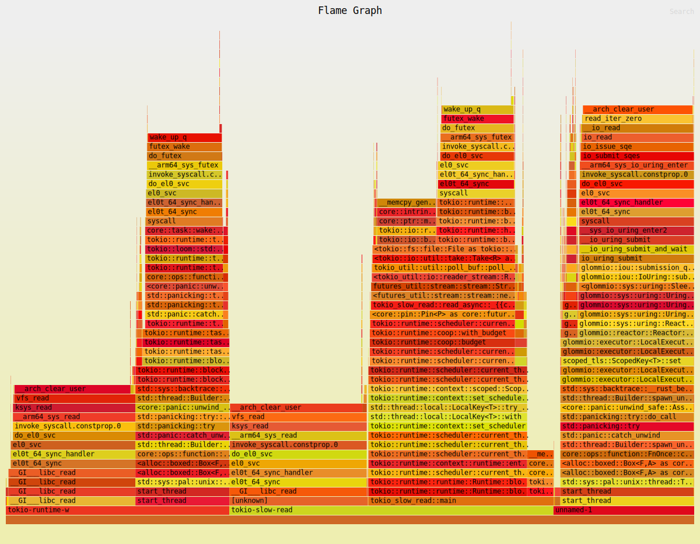

# Tokio Slow Read

This repo illustrates how [`tokio`](https://tokio.rs/) is slow on Linux compared
to macOS when reading `/dev/zero` for no particular reason.

## Benchmark numbers

The numbers below are from running `cargo run --release`. There are 3 numbers:

* Copying one buffer to another (rock bottom baseline)
* Reading 10GB of `/dev/zero` synchronously
* Reading 10GB of `/dev/zero` via tokio

On my M1 Macbook Air:

* macOS:

```
copy buf in 254ms
sync read in 234ms
async read in 852ms
```

* Linux VM (`6.11.0-rc7`):

```
copy buf in 116ms
sync read in 536ms
async read in 2624ms
```

Huh! Copying a buffer is faster than macOS, sync read is slower, and async read
is abysmally slow.

* Same Linux VM, but the binary constrained to one CPU via `taskset -c 0`:

```
copy buf in 107ms
sync read in 537ms
async read in 765ms
```

Here async is not as slow anymore, it's even faster than macOS.

To see why non-pinned version is slow, one can get a flamegraph:

```
cargo flamegraph --root --cmd 'record -F 997 -e cpu-clock --call-graph dwarf,16384 -g'
```



That's a lot of `futex` wakes burning CPU.
